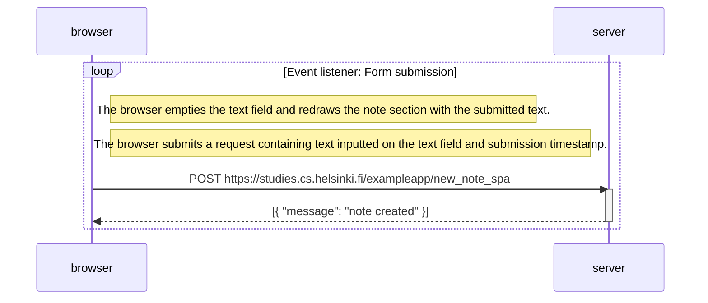

Diagram depicting chains of events caused by a note submission on a Single Page Application.

```mermaid
    sequenceDiagram
    participant browser
    participant server

    loop Event listener: Form submission
    Note right of browser: The browser empties the text field and redraws the note section with the submitted text.
    
    Note right of browser: The browser submits a request containing text inputted on the text field and submission timestamp.

    browser->>server: POST https://studies.cs.helsinki.fi/exampleapp/new_note_spa
    activate server
    server-->>browser: [{ "message": "note created" }]
    deactivate server
    end

```
